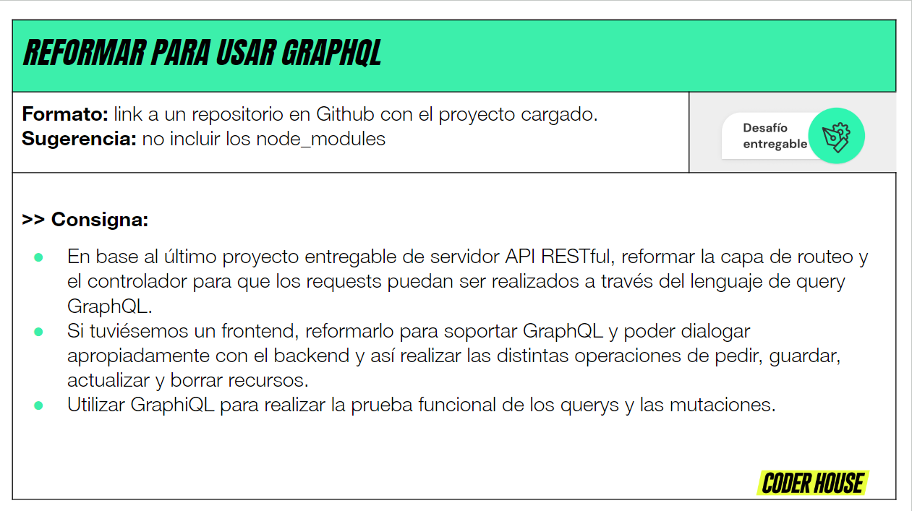
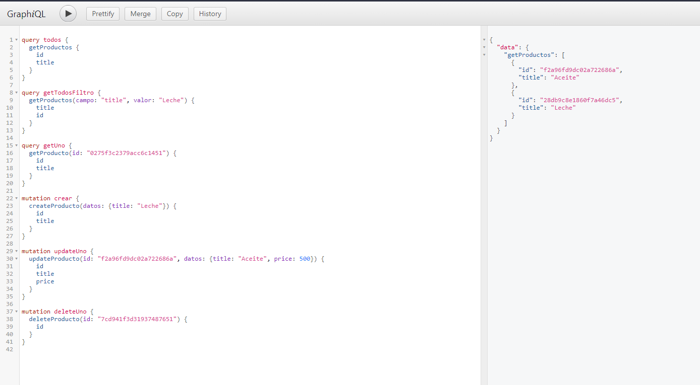

# Entrega 22

## Querys y mutaciones

```console
query todos {
  getProductos {
    id
    title
  }
}

query getTodosFiltro {
  getProductos(campo: "title", valor: "Leche") {
    title
    id
  }
}

query getUno {
  getProducto(id: "0275f3c2379acc6c1451") {
    id
    title
  }
}

mutation crear {
  createProducto(datos: {title: "Leche"}) {
    id
    title
  }
}

mutation updateUno {
  updateProducto(id: "f2a96fd9dc02a722686a", datos: {title: "Aceite", price: 500}) {
    id
    title
    price
  }
}

mutation deleteUno {
  deleteProducto(id: "7cd941f3d31937487651") {
    id
  }
}
```




