# Entrega 16

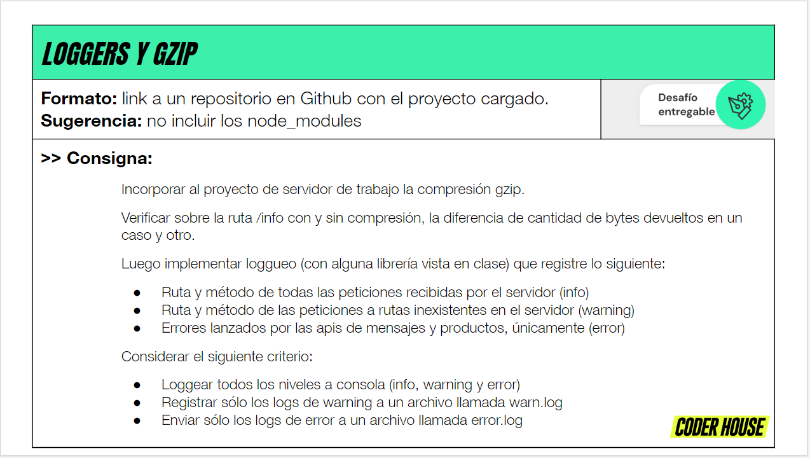

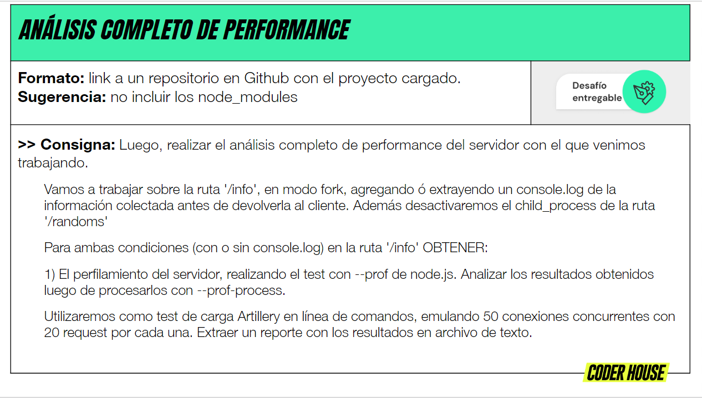

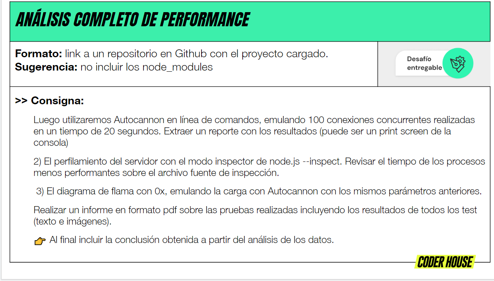

## Sin GZIP

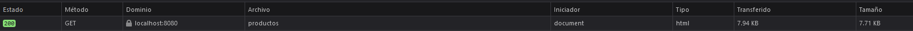

## Con GZIP

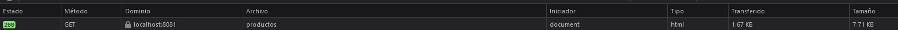

## Logs de Winston

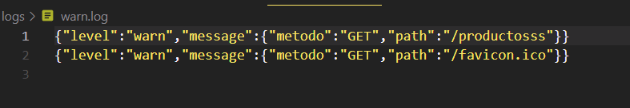

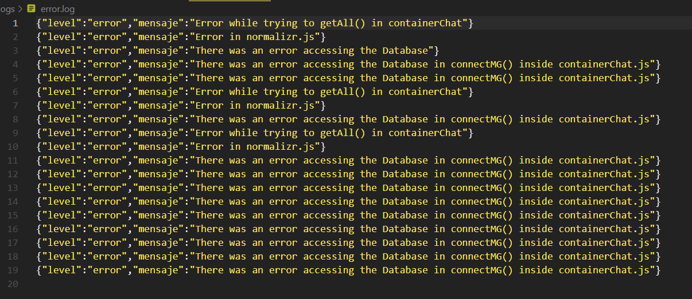

## Sumario de artillery

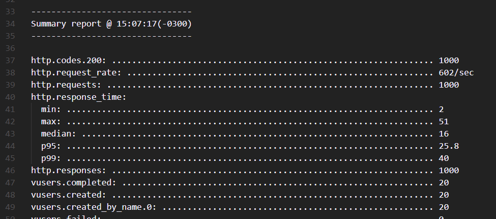

## Sumario de node --prof

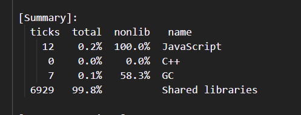

## Información de autocannon

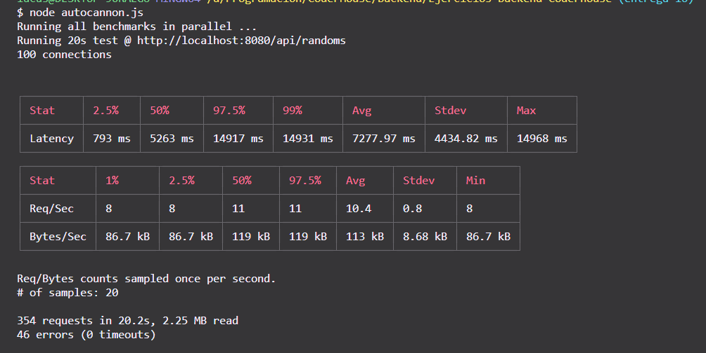

## Google Node profiler

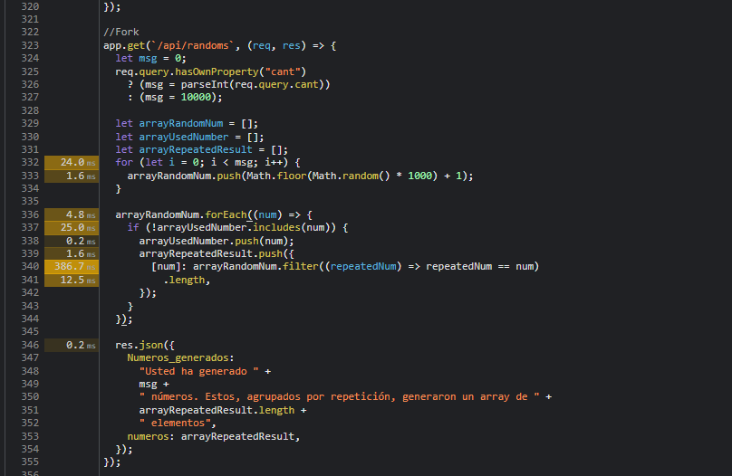

## Gráficos de flama

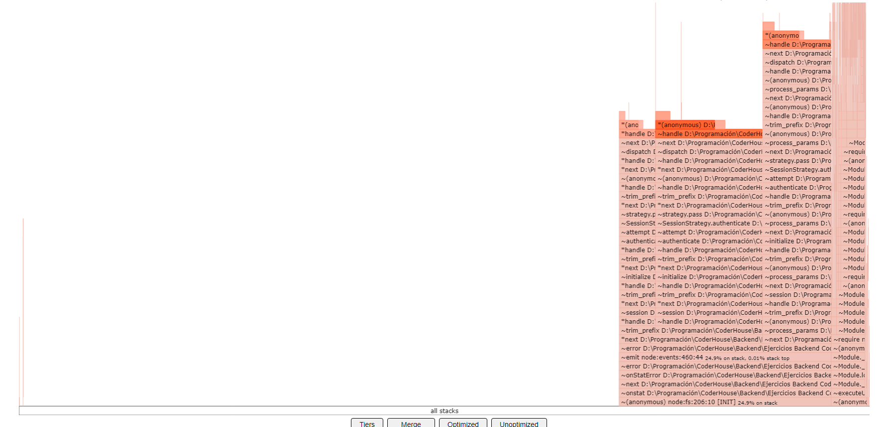

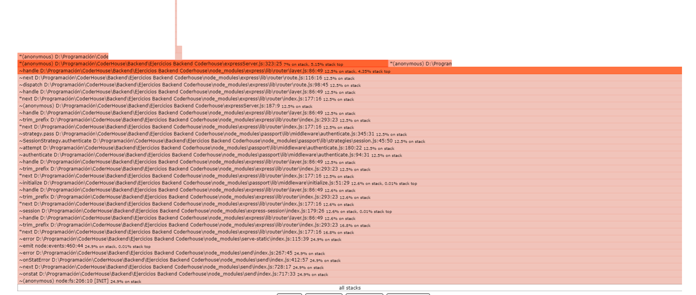
