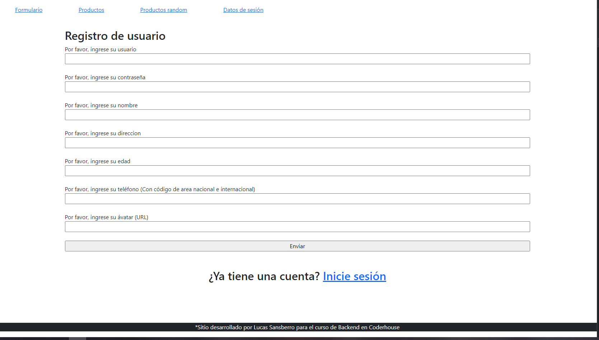
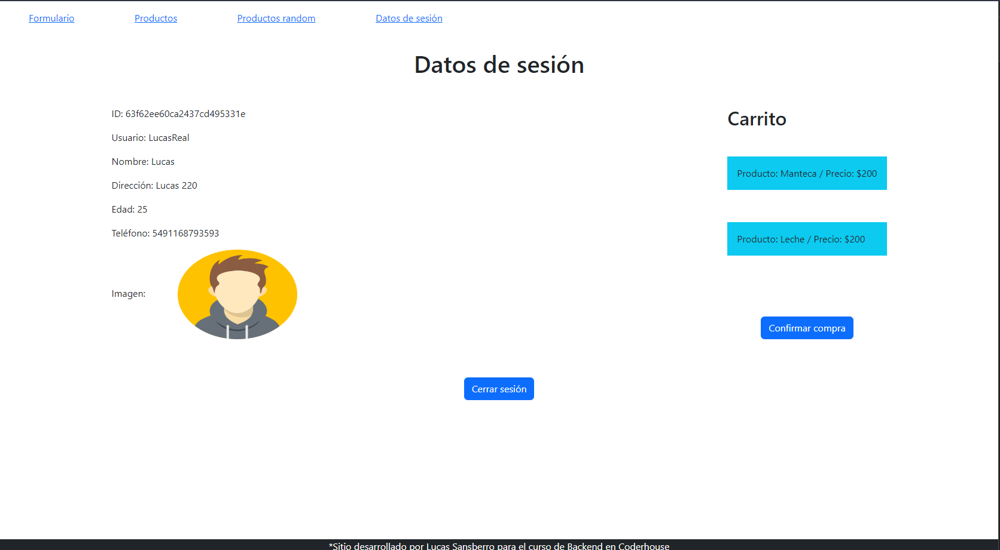
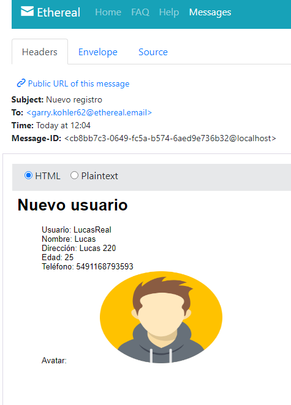
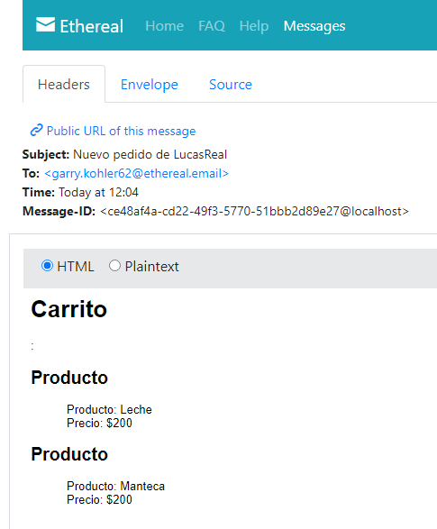
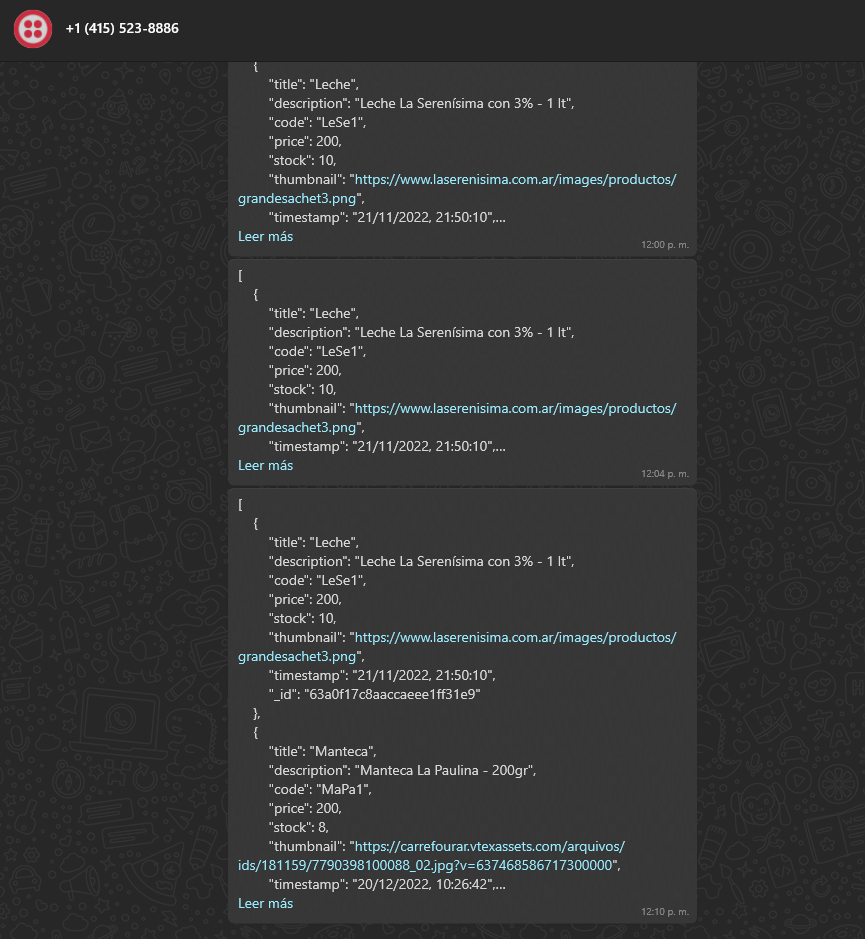

# Entrega final

## E-commerce para un almacén, realizando en backend con Node.js, Express, Handlebars y Mongo

### Contiene registro de usuarios, así como inicio de sesión. CRUD de productos y compra con carrito, que envía correos de confirmación, así como mensajes de texto y WhatsApp

### Hosteado en Railway

### Registro de usuarios

### Detalles de usuario

### Nodemailer, creación de usuario

### Nodemailer, compra

### Twilio, Whatsapp

### Twilio, SMS

