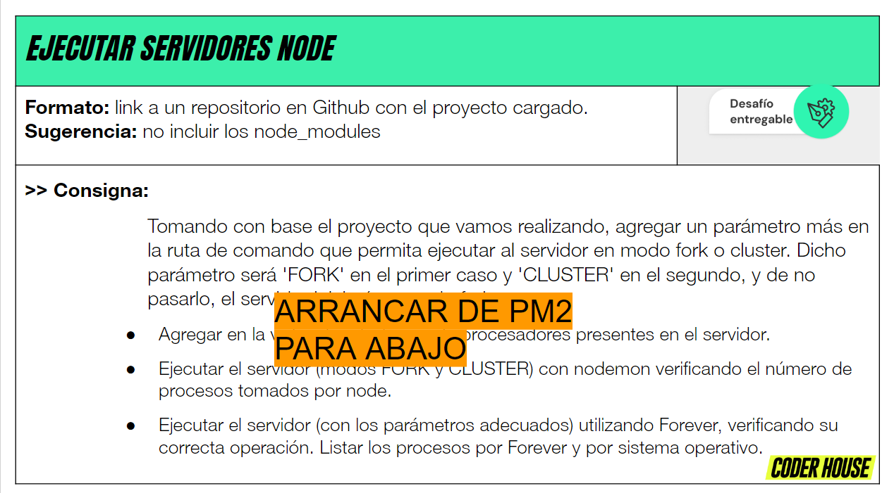
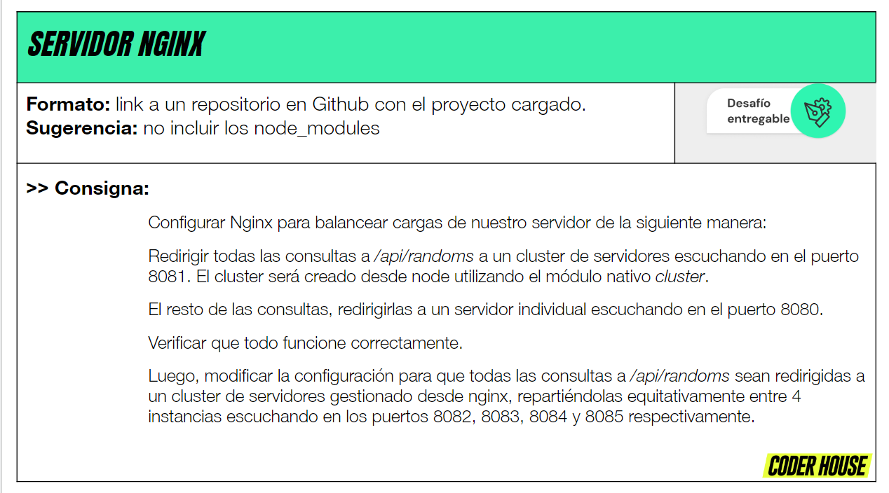
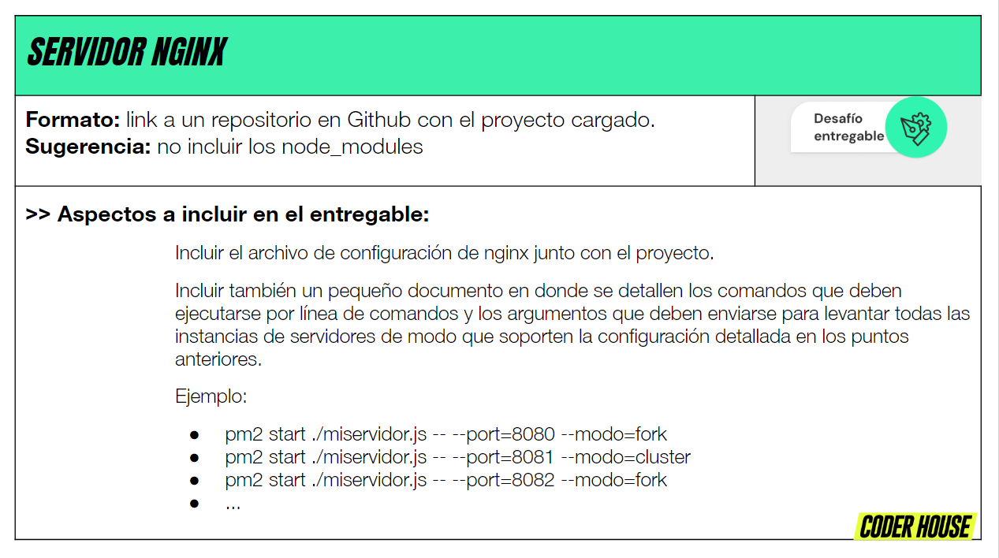
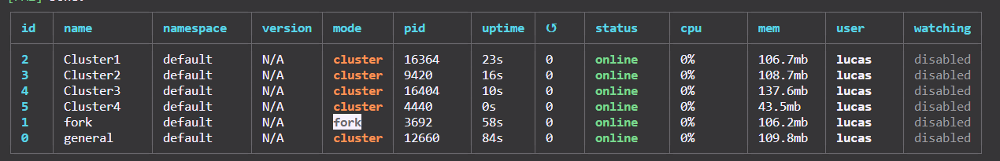
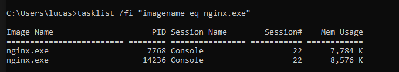
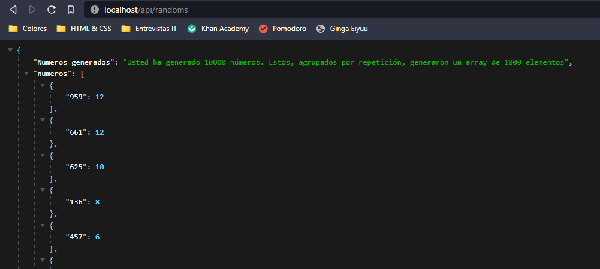

# Entrega 14














## Comenzar el servidor con los siguientes comandos

```console
pm2 start expressServer.js --name="general" -i 1

pm2 start expressServer.js --name="fork" -- --port 8081

pm2 start expressServer.js --name="Cluster1" -i 1 -- --port 8082

pm2 start expressServer.js --name="Cluster2" -i 1 -- --port 8083

pm2 start expressServer.js --name="Cluster3" -i 1 -- --port 8084

pm2 start expressServer.js --name="Cluster4" -i 1 -- --port 8085
```
