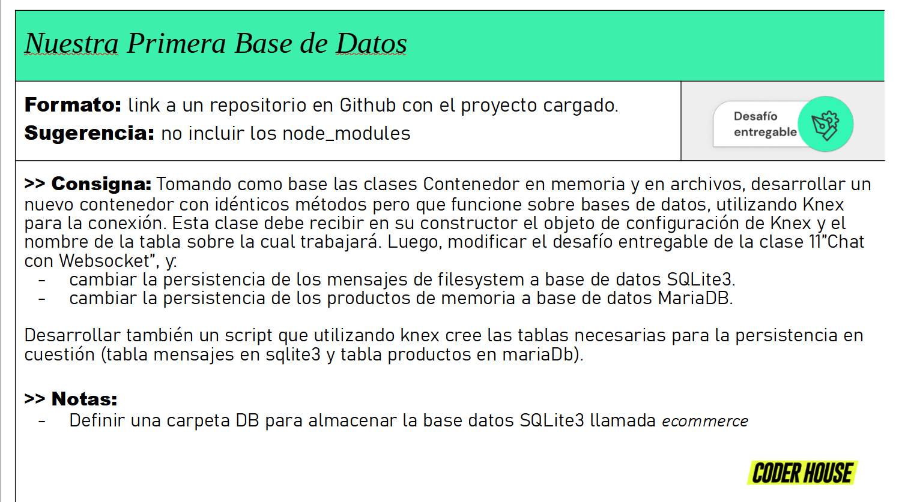

# Entrega 8

## 1) Abrir puertos para MySQL

## 2) Ejecutar createTable.js en ./DB/MySQL para crear la tabla de productos

## 3) Hacer lo mismo en ./DB/SQLite en caso de que la tabla de chat no aparezca dentro de ecommerce.sqlite

## 4) Ejecutar expressServer.js
